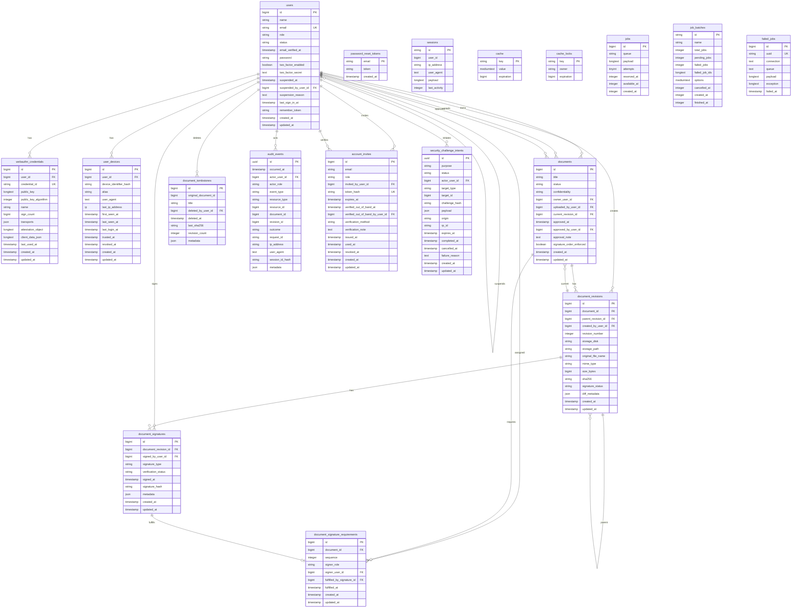

# Database Schema Graph

Source: Laravel migrations in `database/migrations`.

Regenerated: 2026-06-11.

Open `docs/architecture/database-schema.mmd` in any Mermaid renderer, or view this Markdown in a Mermaid-enabled viewer.

## Legacy Approval Columns

- The document approval columns and `document_signature_requirements` table remain for migration compatibility and historical data.
- The active workflow publishes new uploads directly to VCS and does not create admin approval or signature-requirement records.

## Notes

- `sessions.user_id` is indexed but does not have a declared foreign key in the Laravel migration.
- `audit_events.document_id`, `audit_events.revision_id`, `audit_events.resource_type`, and `audit_events.resource_id` are audit references, not declared foreign keys.
- `security_challenge_intents.target_type` and `target_id` are polymorphic target references, not declared foreign keys.
- `document_tombstones.original_document_id` preserves the deleted document id and is not declared as a foreign key.
- `document_signature_requirements.signer_role` stores role-based requirements; `signer_user_id` stores explicit user requirements. One or the other is expected for each configured requirement.
