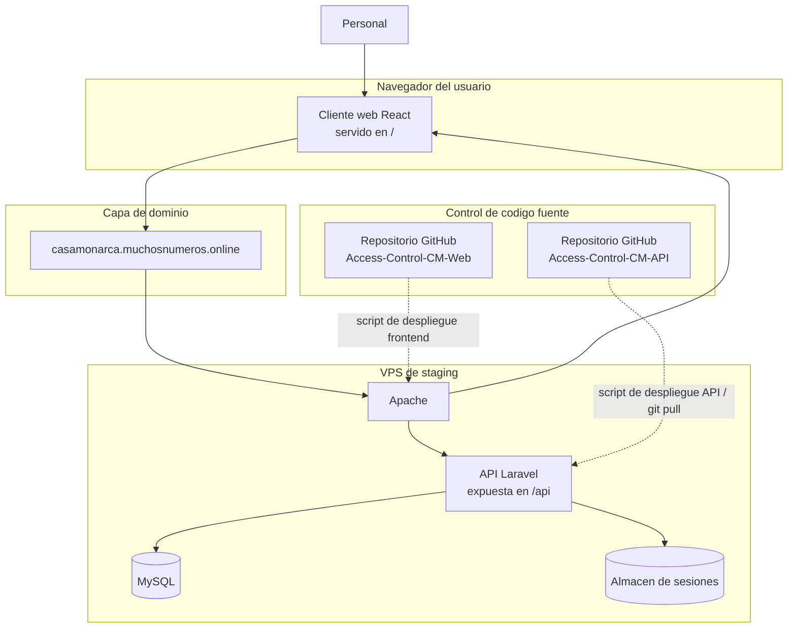
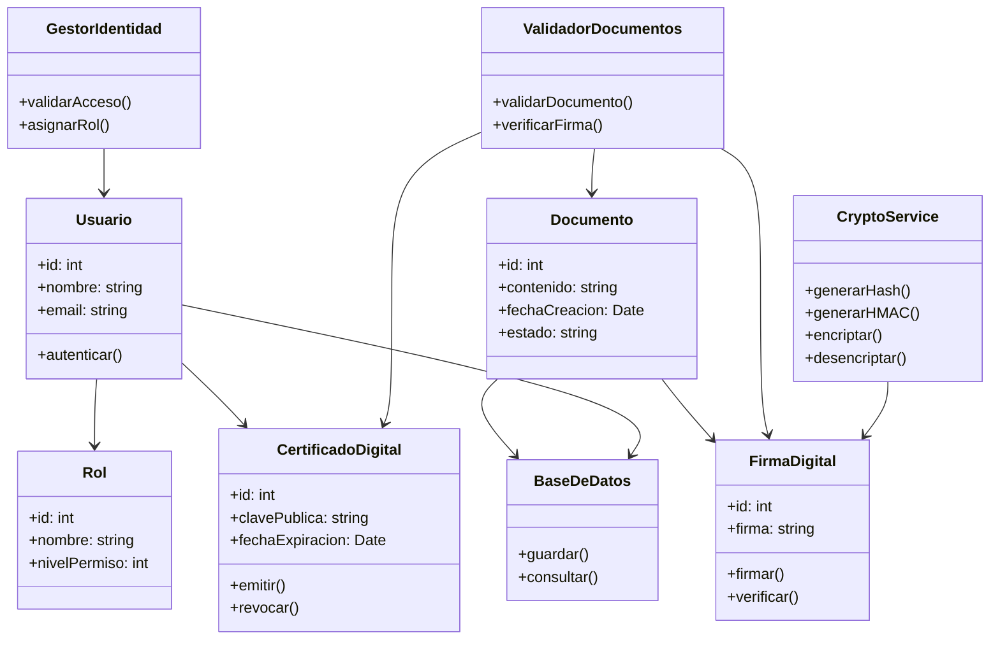
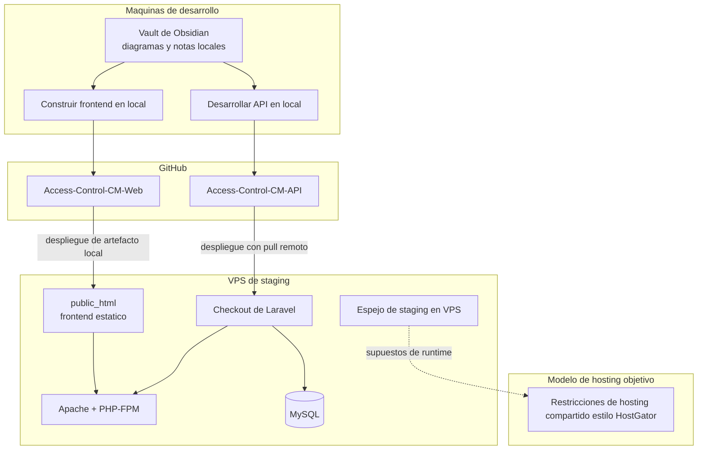
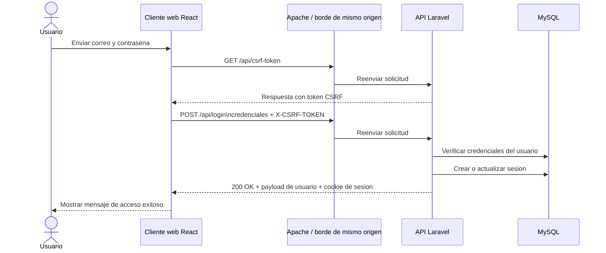
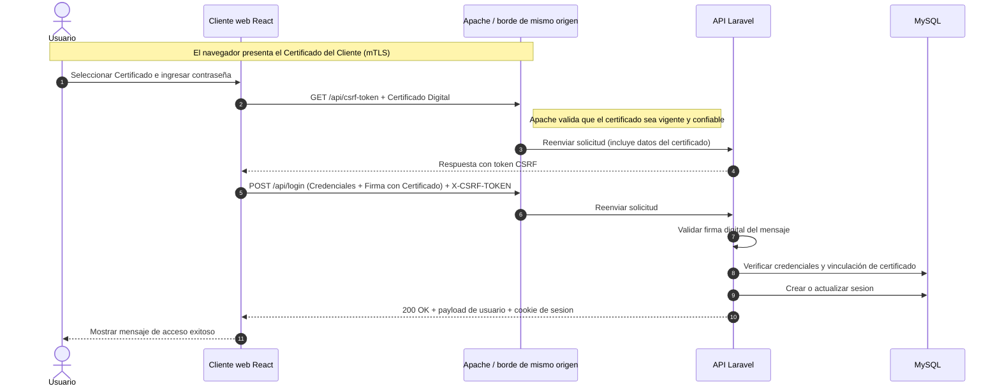
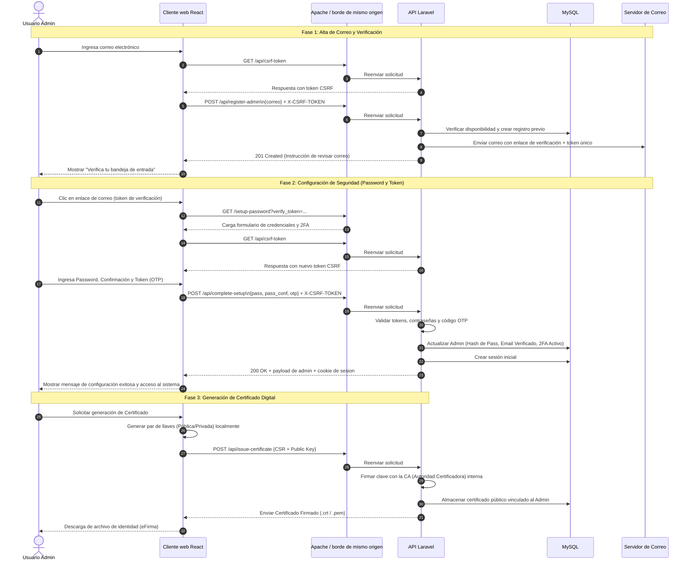

# evidencias_reto

En este repositorio se estarán almacenando los entregables de las evidencias a realizar. Incluyendo archivos de documentación y ejecución.

## Diagrama de Gantt
Para visualizar el diagrama de Gantt, favor de descargar el archivo *gantt.json*. Favor de cargar el archivo anteriormente descargado en el [visualizador de Gantt](https://carleslc.me/Gantt/) para más detalle. 

## Diagrama de Contenedores

## Modelo conceptual de confianza y documentos

## Vista de Despliegue

## Secuencia de Inicio de Sesion

## Secuencia de Inicio de Sesion e.Firma

## Secuencia de Registro de Usuario

